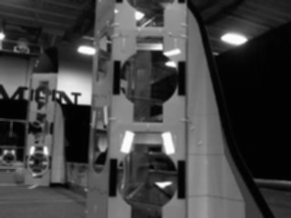
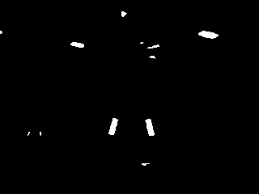
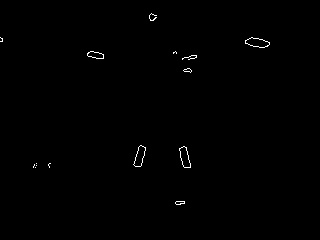
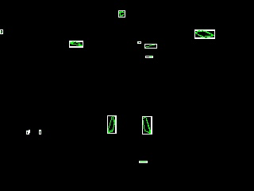
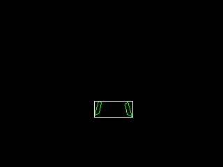

# Image Processing with Vision Tracking

A simple vision tracking example using a sample image from the internet and OpenCV.
The vision tracking code can be found [here](src/test/java/frc/Vision.java).

We start the image processing by converting the image into gray scale.

We then blur the image so that we can smooth out our image.

Next we use a technique called thresholding to "filter" any values we don't want.

We then use an algorithm called canny, which finds the edges of each item left after the threshold and returns the contours of each object.

We can now draw bounding boxes on each object we were able to find.

Finally, we perform some checks on each object to filter the noise and leave only the actual targets.

