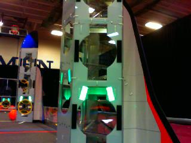

# Image Processing with Vision Tracking

A simple vision tracking example using a sample image from the internet and OpenCV.
The vision tracking code can be found [here](src/test/java/frc/Vision.java).

This is a sample frame of what a camera might see:



We start the image processing by converting the image into gray scale.

```java
Imgproc.cvtColor(defaultFrame, grayFrame, Imgproc.COLOR_BGR2GRAY);
```


We then blur the image so that we can smooth out our image.

```java
Imgproc.blur(grayFrame, blurredGrayFrame, new Size(3, 3));
```


Next we use a technique called thresholding to "filter" any values we don't want.

```java
Imgproc.threshold(blurredGrayFrame, threshFrame, 240, 255, Imgproc.THRESH_BINARY);
```


We then use an algorithm called canny, which allows us to run another algorithm that finds the contours.

```java
Imgproc.Canny(threshFrame, cannyFrame, 240, 255);
Imgproc.findContours(cannyFrame, contours, hierarchy, Imgproc.RETR_TREE, Imgproc.CHAIN_APPROX_SIMPLE);
```


We can now draw bounding boxes on each object we were able to find using the contours.

```java
// Iterate through each contour and approximate the bounding boxes
for (int i = 0; i < contours.size(); i++) {
    contoursPoly[i] = new MatOfPoint2f();
    Imgproc.approxPolyDP(new MatOfPoint2f(contours.get(i).toArray()), contoursPoly[i], 3, true);
    boundRect[i] = Imgproc.boundingRect(new MatOfPoint(contoursPoly[i].toArray()));
    // Add the filtering info after the bounding box has been created
    tl_Corners[i] = boundRect[i].tl();
    areas[i] = boundRect[i].area();
}
// Store each polygon we were able to create after approximating the bounding
// box curves
List<MatOfPoint> contoursPolyList = new ArrayList<>(contoursPoly.length);
for (MatOfPoint2f poly : contoursPoly) {
    contoursPolyList.add(new MatOfPoint(poly.toArray()));
}

```


Finally, we perform some checks on each object to filter the noise and leave only the actual targets.

```java
// Filter algorithm
for (int i = 0; i < contours.size(); i++) {
    // If we have 2 potential targets then stop running the check
    if (potentialTargets.size() == 2)
        break;
    // Loop through every other bounding box and perform checks relative to itself
    for (int j = 0; j < contours.size(); j++) {
        if (j != i && Math.abs(areas[j] - boundRect[i].area()) <= areaTolerance
                && boundRect[i].width < boundRect[i].height && boundRect[i].area() > MIN_AREA) {
            potentialTargets.add(boundRect[i]);
            Imgproc.drawContours(frame, contoursPolyList, i, green);
            break;
        }
    }
}
// Draw the bounding box encapsulating the targets
Imgproc.rectangle(frame, potentialTargets.get(1).tl(), potentialTargets.get(0).br(), white, 1);
// Return the processed frame
return frame;
}
```


